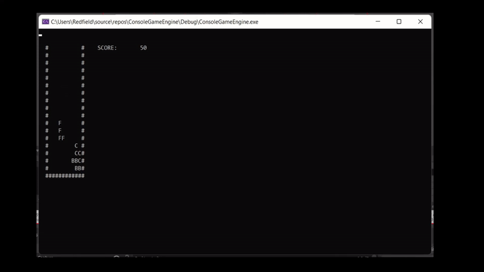

# consoleGameEngine

Here is a demonstration of consoleGameEngine. I used consoleGameEngine to implement tetris. Code for tetris can be found [here](tetrisUsingEngine.cpp)


## Project Overview
This is a simple game engine for C++.

## What it does

This is essentially a C++ library that handles most of grunt work for you when make a game.

It first sets up the screen buffer for displaying game output using
```c++
void setupScreenBuffer()
```
Then it handles the game loop using
```c++
void runGame()
```
Inside **runGame()**, it uses **handleInput()** and **handleOutput()** to handle input and output. In particular, it uses the windows console as the screen buffer for video output. And the **setupGameAssets()** and **GameUpdate(fElapsedTime)** are abstract methods that you override to implement all the specifics of your particular game

```c++
void runGame() {
		gameActive = true;

		setupGameAssets();

		auto startTime = std::chrono::system_clock::now();// time points for handling timing. elapsed time per tick in while loop in particular
		auto endTime = std::chrono::system_clock::now();

		while (gameActive) {
			// game timing: timing is important because some people's computers run faster than others'
			// this_thread::sleep_for(50ms); // one game tick, previous timing code
			endTime = std::chrono::system_clock::now();// calculates elapsed time and updates tp1 for next tick
			std::chrono::duration<float> elapsedTime = endTime - startTime;
			startTime = endTime;
			float fElapsedTime = elapsedTime.count();

			handleInput();
			if (!GameUpdate(fElapsedTime)) {
				gameActive = false;
			}
			handleOutput();
		}

		// display the score after the loop ends
		CloseHandle(hConsole);
		system("pause");
	}
```

## How I built it
I coded it by following along Javidx9's [console game engine video](https://www.youtube.com/watch?v=8OK8_tHeCIA&list=PLrOv9FMX8xJE8NgepZR1etrsU63fDDGxO&index=1). I adapted his ideas based on my own needs and understanding, so I have deleted a lot of code that I don't need yet and changed the naming convention and some functions and variables
  

